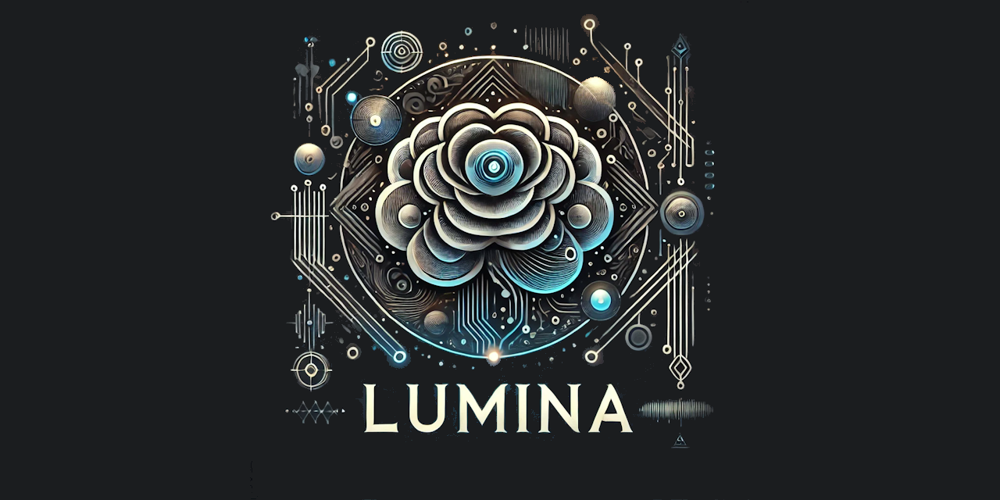

  

🌟 **Introducing Lumina: Local Generative AI for Delphi Developers** 💻🤖  

Delphi developers, the future of AI is here, and it’s **local**! Say hello to **Lumina** – your all-in-one toolkit for embedding **powerful generative AI** directly into your Delphi applications. Built on the proven foundation of **llama.cpp**, Lumina lets you integrate cutting-edge AI features with unparalleled ease and flexibility. 🚀  

🎯 **Why Lumina?**  
- **Local Power**: Run AI **entirely offline**, ensuring privacy and complete control over your data. 🛡️  
- **Broad Compatibility**: Supports **<a href="https://huggingface.co/bartowski/gemma-2-2b-it-abliterated-GGUF" target="_blank">any GGUF model</a>** compatible with llama.cpp, giving you access to a wide array of state-of-the-art AI models. 🌐 
- **Developer-Friendly**: A simple yet powerful API to load/unload models, perform inference, and manage custom callbacks. No steep learning curves here! 📚  
- **Scalable Features**: While this first release focuses on **stability** and essential functionality, exciting new features are already in the works! 🌱  

💡 **What Can You Do with Lumina?**  
- Create intelligent chatbots 🤖  
- Generate text, summaries, or creative content ✍️  
- Add dynamic AI-powered features to your applications 💬  
- Streamline processes with real-time AI inference ⚡  

🔧 **Key Features**  
- **Flexible API**: Manage models, set progress trackers, and handle tokens with callbacks.  
- **Effortless Integration**: Built for Delphi, designed for developers – no extra dependencies needed.  
- **Focused Stability**: Perfect for production-ready environments and rapid prototyping alike.  

✨ **Lumina is Your AI Superpower**  
Lumina is more than just a tool – it’s your gateway to the next generation of AI-enhanced software, all while keeping your data safe and local. Whether you’re creating tools, games, or business apps, **Lumina makes AI integration simple, efficient, and exciting**.  

https://github.com/user-attachments/assets/165e3dee-b29f-4478-b9ef-4fb6d2df2485

### Contributing

Contributions to **Callisto** are highly encouraged. Please feel free to submit issues, suggest new features, or create pull requests to expand the capabilities and robustness of the scripting engine.

### License

**Callisto** is distributed under the 🆓 **BSD-3-Clause License**, allowing for redistribution and use in both source and binary forms, with or without modification, under specific conditions. See the [LICENSE](https://github.com/tinyBigGAMES/Lumina?tab=BSD-3-Clause-1-ov-file#BSD-3-Clause-1-ov-file) file for more details.

### Support

- <a href="https://github.com/tinyBigGAMES/Lumina/issues" target="_blank">Issues</a>
- <a href="https://github.com/tinyBigGAMES/Lumina/discussions" target="_blank">Discussions</a>
- <a href="https://learndelphi.org/" target="_blank">Learn Delphi</a>

---
🎉 Ready to experience the future? Join the revolution and let Lumina bring your Delphi projects to life with the power of local AI. 🚀  

<h5 align="center">

Made with :heart: in Delphi
</h5>
